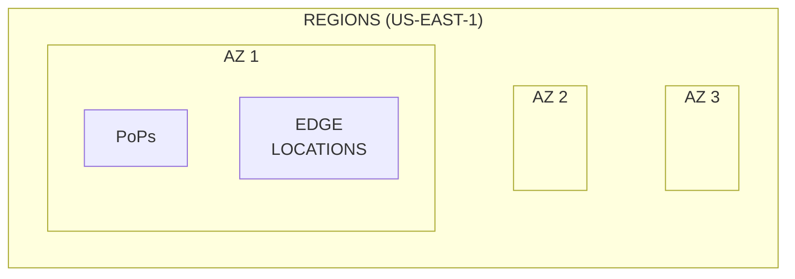

# [AWS] - CLF-C02 - Cloud Practitioner

# What is Cloud Computing and AWS?

---

### Regions and Zone

Each region have a different cost. That depends on availability of the service and taxes. 

## S3 Storage Classes

[Docs](https://aws.amazon.com/s3/storage-classes/)

| Storage Class | Use Case | Durability | Availability | Retrieval Time | Price |
| --- | --- | --- | --- | --- | --- |
| S3 Standard | General purpose | 99.999999999% | 99.99% | Milliseconds | $$ |
| S3 Intelligent-Tiering | Variable access patterns | 99.999999999% | 99.9% | Milliseconds | $$ |
| S3 Standard-IA | Infrequent access | 99.999999999% | 99.9% | Milliseconds | $ |
| S3 One Zone-IA | Infrequent access, single AZ | 99.999999999% | 99.5% | Milliseconds | $ |
| S3 Glacier Instant Retrieval | Archival, infrequent access | 99.999999999% | 99.9% | Milliseconds | $ |
| S3 Glacier Flexible Retrieval | Archival, flexible retrieval | 99.999999999% | 99.9% | Minutes | $ |
| S3 Glacier Deep Archive | Archival, long-term | 99.999999999% | 99.9% | Hours | $ |