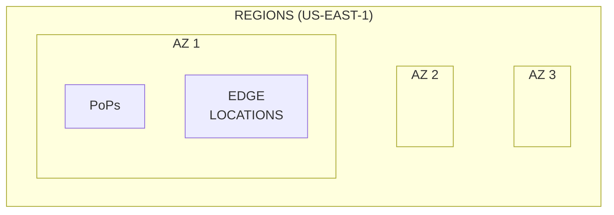
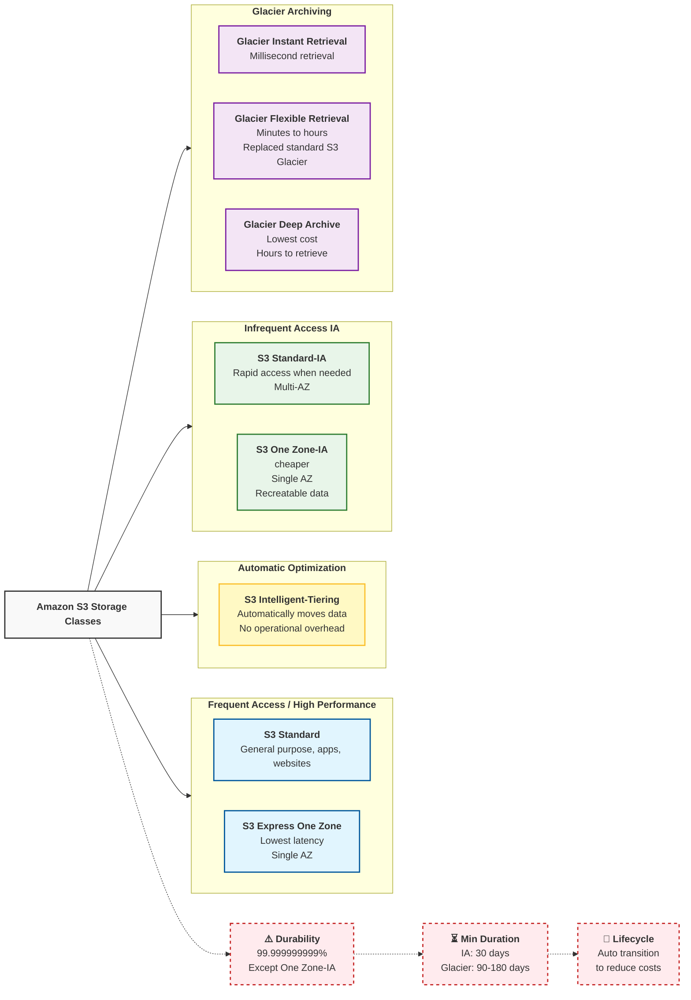
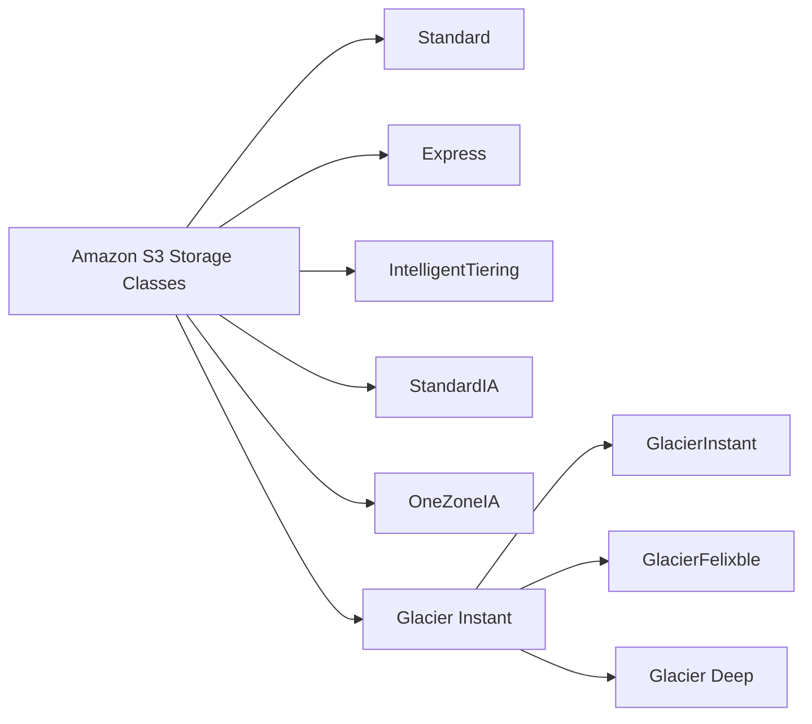

# [AWS] - CLF-C02 - Cloud Practitioner

# S3 

One of the services provided by AWS in Cloud. Is a HD in cloud. It is able to upload several types of files, such as .docx, .xsls, ... you pay as you go. 
You can think in S3 like a closet and there are many drawer. Like you can create folder in you computer, they decide to put bucket to be different.

When creat a bucket there are two options: 
* General purporse - recommended to most of use cases 
* Directory - recommended for low-latency, such as a game. for example.

## S3 Storage Classes

[Docs](https://aws.amazon.com/s3/storage-classes/)

| Storage Class                 | Use Case                     | Durability    | Availability | Retrieval Time | Price |
| ----------------------------- | ---------------------------- | ------------- | ------------ | -------------- | ----- |
| S3 Standard                   | General purpose              | 99.999999999% | 99.99%       | Milliseconds   | $$    |
| S3 Intelligent-Tiering        | Variable access patterns     | 99.999999999% | 99.9%        | Milliseconds   | $$    |
| S3 Standard-IA                | Infrequent access            | 99.999999999% | 99.9%        | Milliseconds   | $     |
| S3 One Zone-IA                | Infrequent access, single AZ | 99.999999999% | 99.5%        | Milliseconds   | $     |
| S3 Glacier Instant Retrieval  | Archival, infrequent access  | 99.999999999% | 99.9%        | Milliseconds   | $     |
| S3 Glacier Flexible Retrieval | Archival, flexible retrieval | 99.999999999% | 99.9%        | Minutes        | $     |
| S3 Glacier Deep Archive       | Archival, long-term          | 99.999999999% | 99.9%        | Hours          | $     |

> Amazon S3 offers several storage classes designed for different data access patterns, performance needs, and cost-optimization goals. Key classes include S3 Standard (frequent access), S3 Intelligent-Tiering (automatic savings), S3 Standard-IA/One Zone-IA (infrequent access), and S3 Glacier (archive) options, all offering high durability.

### Key Amazon S3 Storage Classes:
* **S3 Standard**: Designed for frequently accessed data, providing high throughput and low latency. Ideal for cloud apps, websites, and content distribution.
* **S3 Intelligent-Tiering**: Automatically optimizes costs by moving data between frequent and infrequent access tiers based on changing patterns without operational overhead.
* **S3 Standard-Infrequent Access (S3 Standard-IA)**: Suitable for data accessed less frequently but requiring rapid access when needed, at a lower storage price than S3 Standard.
* **S3 One Zone-Infrequent Access (S3 One Zone-IA)**: Similar to S3 Standard-IA, but stores data in a single Availability Zone, making it 20% lower cost, ideal for re-creatable, non-critical data.
* **S3 Glacier Instant Retrieval**: Archive storage for data accessed rarely, yet requiring millisecond retrieval.
* **S3 Glacier Flexible Retrieval**: Replaced S3 Glacier, supporting data archiving with retrieval times from minutes to hours.
* **S3 Glacier Deep Archive**: Lowest-cost storage class, designed for data that is rarely accessed, with retrieval times within hours.
* **S3 Express One Zone** : High-performance storage class for frequently accessed data, providing the lowest latency.

### Key Considerations
* **Durability**: All S3 storage classes (except S3 One Zone-IA) store data across multiple, geographically separated Availability Zones to ensure 99.999999999% durability.
* **Minimum Storage Duration**: IA and Glacier classes have minimum storage duration charges (e.g., 30 days for IA, 90-180 days for Glacier).
* **Lifecycle Policies**: You can use Lifecycle rules to automatically transition objects between storage classes to reduce costs as data ages

---
| **Key Words**      |    **Content**        | 
| ------------------ |                  ---------- | 
| Data access patterns   Performance needs   Cost-optimization|  **Classes:**   S3 Standard   S3 Intelligent-Tiering   Standard IA   S3 Glacier                  | 
|                                                                    |                            | 

> 

<h3>

 Diagram view

</h3>

