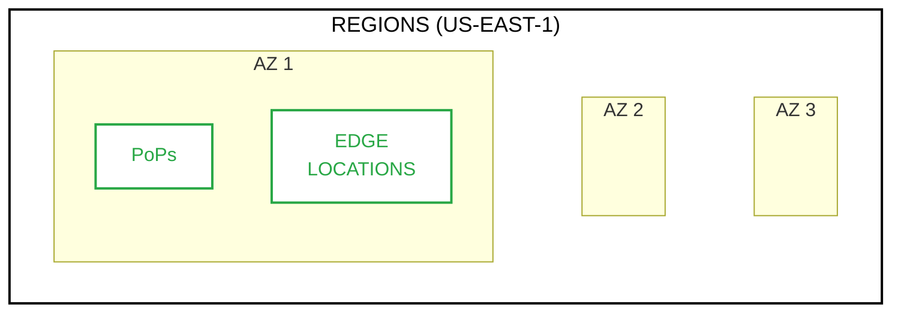

# [AWS] - CLF-C02 - Cloud Practitioner

# What is Cloud Computing and AWS?

Cloud Computing in a few words the usage of public servers. The AWS, Amazon Web Services, started in. Wasn’t the pioneer, but is one of mainly character in Cloud Computing today. The Amazon was one of the first company to use Data Centers. 

<aside>
💡

Cloud Computing is basically to rent a solution. Rent a public server. 

</aside>

There are a few types of Cloud Computing:

- Public - Azure, GCP and AWS. A shared environment.
- Private - The server run in your own company.
    - Hybrid - combine both above solutions.

**Advantage to use Cloud**

On Demand Services - You can create the service and pay as you go. 

Elasticity - Increase or decrease the service as demand needs. Memory, processing and so on. 

Global Access. Available to access from everywhere. 

[Global Infrastructure Regions & AZs](https://aws.amazon.com/about-aws/global-infrastructure/regions_az/)

---

### Creating an account in AWS

Free tier 

---

### Regions and Zone

Each region have a different cost. That depends on availability of the service and taxes. 

## S3 Storage Classes

[Docs](https://aws.amazon.com/s3/storage-classes/)

| Storage Class | Use Case | Durability | Availability | Retrieval Time | Price |
| --- | --- | --- | --- | --- | --- |
| S3 Standard | General purpose | 99.999999999% | 99.99% | Milliseconds | $$ |
| S3 Intelligent-Tiering | Variable access patterns | 99.999999999% | 99.9% | Milliseconds | $$ |
| S3 Standard-IA | Infrequent access | 99.999999999% | 99.9% | Milliseconds | $ |
| S3 One Zone-IA | Infrequent access, single AZ | 99.999999999% | 99.5% | Milliseconds | $ |
| S3 Glacier Instant Retrieval | Archival, infrequent access | 99.999999999% | 99.9% | Milliseconds | $ |
| S3 Glacier Flexible Retrieval | Archival, flexible retrieval | 99.999999999% | 99.9% | Minutes | $ |
| S3 Glacier Deep Archive | Archival, long-term | 99.999999999% | 99.9% | Hours | $ |