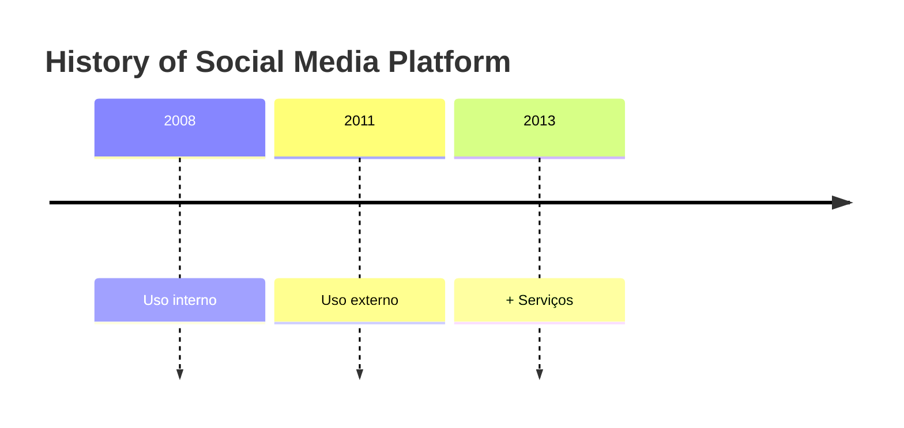
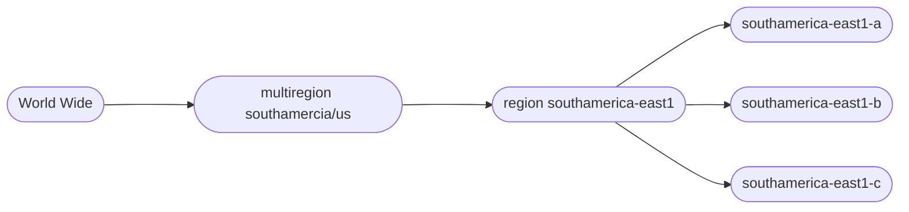

# Introdução ao GCP - Google Cloud Plataform 

## História da Goolge Cloud Plataform 

A Google  é uma empresa com grande história em serviços digitais como o próprio **Google Search** e **Youtube**, por exemplo.  

Em 2008, a google começou a prestar serviços em cloud, mas apenas para uso interno.Em 2011 passou a ser externo e em 2013 ganhou mais serviços. 

A Google tem grandes clientes e detém uma fatia interessante do mercado de Cloud, juntamente com a Amazon e a Microsoft.   

## Zonas e Regiões

A melhor forma de resumir essa divisão é pensar em uma estrutura de matrioska (bonecas russas) ou em uma hierarquia geográfica de disponibilidade. No GCP, você organiza seus recursos de "fora para dentro":

As **Regiões** são áreas geográficas independentes e distantes (como São Paulo **``southamerica-east1``** ou Virgínia **``us-east1``**) que você escolhe para manter os dados perto dos usuários ou atender a requisitos legais. Elas servem como o nível mais alto da hierarquia, garantindo que, se um desastre ocorrer em um ponto do globo, os serviços em outras regiões permaneçam operacionais.

Uma Região é uma localização geográfica específica onde você pode hospedar seus recursos. Elas são áreas independentes e distantes umas das outras (geralmente centenas de quilômetros).

> Exemplo: ``southamerica-east1``(São Paulo) ou ``us-east1`` (Carolina do Sul).

Propósito: Latência e conformidade legal. Você escolhe a região para ficar perto do seu cliente ou para obedecer a leis de dados de um país.

Isolamento: Se uma região inteira falhar (algo extremamente raro, como um desastre natural em larga escala), as outras continuam operando.

Já as **Zonas** são subdivisões físicas dentro de uma região, funcionando como data centers isolados com infraestrutura de energia e rede própria. A estratégia ideal é distribuir sua aplicação em múltiplas zonas da mesma região: assim, se uma zona sofrer uma falha técnica local, as outras garantem que seu sistema continue no ar sem interrupções.

Uma Zona é uma área de implantação dentro de uma região. Elas são os "braços" físicos de uma região.

Exemplo: Dentro da região southamerica-east1, existem as zonas a, b e c.

Propósito: Alta Disponibilidade (HA) e Redundância.

Conectividade: As zonas dentro de uma mesma região são conectadas por fibras óticas de altíssima velocidade e baixa latência.

Isolamento: Cada zona é isolada para evitar que falhas de infraestrutura (energia, refrigeração, rede) em uma zona afetem a outra.

|Conceito| Escala | Pergunta | Foco Principal|
| ---| ---| ---| ---| 
|Região |Global / Geográfica	| Em qual lugar do mundo meu dado reside?	|Latência e Jurisdição.| 
|Zona |Local / Data Center	|Como protejo minha App contra uma queda de energia local?	|Alta disponibilidade e Falhas físicas.|

Abaixo uma representação em escala da distribuição entre Zonas e Regiões. 

**O que é uma Edge Location?**
> Imagine que as **"Regiões"** são os grandes data centers (as cidades principais), enquanto as "Edge Locations" são os **postos de entrega avançados**, muito mais próximos do usuário final.

[Documentation](https://cloud.google.com/about/locations?hl=pt-br&_gl=1*dui97p*_up*MQ..*_ga*MTQ5MzI0NjU0Ny4xNzYyNTQ2MTEz*_ga_WH2QY8WWF5*czE3NzU2NTcxMzQkbzEyJGcxJHQxNzc1NjU3ODQzJGo1NSRsMCRoMA..*_gs*MQ..&gclid=CjwKCAjw-dfOBhAjEiwAq0RwI2SCRekObd5jnTUiurVsoJpMgeBbiSxETHkctk0fP8ZIh0JwdOnT6hoCzAYQAvD_BwE&gclsrc=aw.ds)

## O que é um Data Center?

Um Data Center é uma instalação física centralizada que abriga servidores e sistemas de armazenamento conectados à internet. É sustentado por uma infraestrutura crítica de refrigeração, energia ininterrupta e conectividade redundante, além de contar com rigorosos protocolos de segurança física e digital para garantir a disponibilidade e a proteção dos dados hospedados.

Principais pilares:
- Servidores e Sistemas de armazenamento
    - Infraestrutura crítica
    - refrigeração
    - Energia ininterrupta
    - Conectividade
    - Segurança

## Sistema de Serviços

Uma forma muito eficiente e intuitiva de organizar **a vasta biblioteca do GCP**  é dividi-la em "Famílias de Necessidades".

Em vez de decorar nomes, você foca no que quer fazer. Aqui está o resumo das principais categorias:

1. **Computação**(O "Cérebro")
Onde você coloca o seu código para rodar.

    - **Compute Engine**: Máquinas Virtuais (você controla tudo).

    - **Google Kubernetes Engine (GKE)**: Para rodar containers (apps modernos).

    - **Cloud Run**: "Serverless" (você sobe o código e o Google escala sozinho).

2. **Armazenamento e Bancos de Dados** (A "Memória")
Onde as informações moram.

    - **Cloud Storage**: Para arquivos (fotos, vídeos, backups).

    - **Cloud SQL**: Bancos de dados tradicionais (MySQL, PostgreSQL).

    - **Firestore:** Banco de dados rápido para apps e documentos (NoSQL).

3. **Redes e Borda** (As "Estradas")
Como os dados viajam.

    - **VPC**: Sua rede privada dentro da nuvem.

    - **Cloud Load Balancing**: Distribui o tráfego para os servidores não sobrecarregarem.

    - **Cloud CDN**: A Edge Location que comentamos, para entregar conteúdo rápido.

4. **Inteligência e Análise** (Os "Insights")
Onde você tira valor dos dados.

    - **BigQuery**: O "queridinho" do GCP; analisa terabytes de dados em segundos.

    - **Vertex AI**: A plataforma completa para criar e treinar Inteligência Artificial.

    - **Pub/Sub**: Para comunicação em tempo real entre sistemas.

Apenas dessas famílias destacadas ainda existem muitas outras. 

## Hierarquia de recursos

O GCP oferece a possibilidade de segmentar os projetos de dentro determinada organização(empresa) e com isso podemos estabelecer recursos (dinheiro) para determinado depertamento. 

[DOCUMENTAÇÃO](https://docs.cloud.google.com/resource-manager/docs/cloud-platform-resource-hierarchy?hl=pt-br)