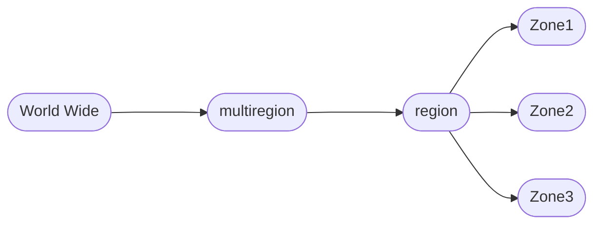

# Introdução ao GCP - Google Cloud Plataform 

## História da Goolge Cloud Plataform 

...

## Zonas e Regiões

```mermaid
flowchart LR

    a([World Wide]) ---> b([multiregion]) ---> c([region]) 

    c --> c1([Zone1])
    c --> c2([Zone2])
    c --> c3([Zone3])

```